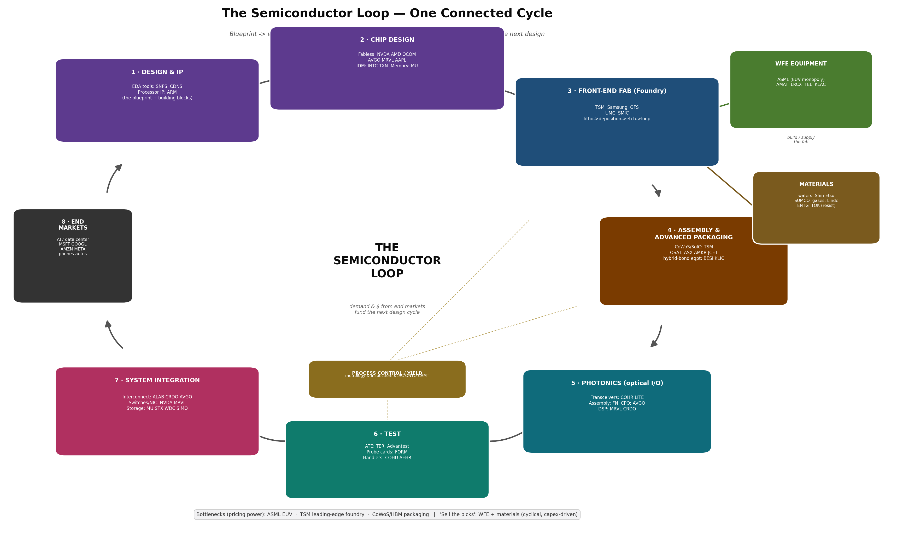

# The Semiconductor Loop — Layer-by-Layer Detail

A companion to `semi_master_loop.png`. The chip industry is best understood as **one connected cycle**: a blueprint becomes a wafer, the wafer becomes a finished package, the package is tested, assembled into a system, sold into an end market, and the cash from that end market funds the next, more advanced design. Below is every layer of that loop, what physically happens inside it, the sub-structures it contains, why it matters, and who plays there.

---

## Feeders into the loop

### WFE — Wafer-Fab Equipment (the tools that build the fab)
The machines a fab is assembled from. Sold once per fab build-out, then serviced. This is the purest "picks-and-shovels" layer: paid on **capex**, agnostic to which chip designer wins.

| Tool type | What it does | Leaders |
|---|---|---|
| **Lithography** | Prints the circuit pattern onto the wafer using light through a photomask. EUV (13.5nm light) is required below ~7nm. | **ASML** (EUV *monopoly*), Canon/Nikon (older DUV) |
| **Deposition** | Lays down ultra-thin films (conductors, insulators) — CVD, PVD, ALD, epitaxy. | AMAT, LRCX, TEL, ASMI |
| **Etch** | Carves the deposited films into the printed pattern, atom layers at a time. | LRCX (leader), AMAT, TEL |
| **Ion implant** | Fires dopant ions into silicon to tune its electrical properties. | AMAT, ACLS (Axcelis) |
| **CMP** | Chemical-mechanical polish — flattens the wafer between layers. | AMAT, Ebara |
| **Cleaning** | Removes particles/residue between every step (a wafer is cleaned dozens of times). | SCREEN, TEL |

**Why it matters:** EUV is the single hardest chokepoint in the entire industry — ASML is the only company on earth that makes an EUV scanner (each ~$200M, ~150 tons). Control of EUV is why export controls to China focus here. **Economics:** high-margin, brutally cyclical (orders swing with fab capex). The "Big 5" = ASML, AMAT, LRCX, TEL, KLAC.

### Materials & chemicals (the consumables a wafer burns through)
Every wafer consumes a stream of physical inputs, layer after layer.
- **Silicon wafers** — the polished starting disc (300mm). Duopoly: **Shin-Etsu, SUMCO**.
- **Photoresist** — light-sensitive coating that lithography patterns. JSR, TOK, Shin-Etsu (Japan-dominated).
- **Specialty gases** — deposition/etch precursors and bulk gases. Linde, Air Liquide, Air Products.
- **CMP slurry & pads** — the abrasive that polishes. CCMP (CMC Materials/Entegris), DuPont.
- **Sputtering targets, photomask blanks, filters** — Entegris (ENTG) spans many of these.

**Why it matters:** a quiet but real chokepoint — Japan's near-monopoly on photoresist and wafers became a geopolitical lever during the 2019 Japan–Korea dispute. **Economics:** recurring, consumable revenue (less cyclical than equipment, tied to wafer *volume* not capex).

---

## The eight loop stages

### 1 · Design & IP — the blueprint and building blocks
Before any silicon, a chip is designed in software and assembled partly from licensed, pre-verified building blocks.
- **EDA (Electronic Design Automation)** — the software suites that simulate, lay out, route, and verify a chip with billions of transistors. No chip is designed without it. Duopoly: **SNPS** (Synopsys), **CDNS** (Cadence), plus Siemens EDA.
- **Semiconductor IP** — reusable circuit blocks licensed rather than designed from scratch: CPU cores (**ARM**), interconnect/SerDes IP (Synopsys, Cadence, Alphawave), memory PHYs (Rambus).
- **Foundry PDK** — the "process design kit" the foundry provides so designs match its manufacturing rules.

**Structures inside:** logic synthesis, place-and-route, design-rule checking, timing closure, tape-out (the final design handed to the fab). **Economics:** asset-light, ~80%+ gross margin, recurring license + royalty, extremely sticky (an entire ecosystem is trained on these tools). **Chokepoint:** EDA duopoly + ARM's ISA are near-monopolies; the threat is RISC-V (open, free architecture).

### 2 · Chip Design — fabless and IDM
The companies that architect the actual product.
- **Fabless** — design only, outsource manufacturing: **NVDA, AMD, QCOM, AVGO, MRVL**, Apple silicon, MediaTek. This is where today's AI margin concentrates.
- **IDM (Integrated Device Manufacturer)** — design *and* own fabs: **INTC, TXN, ADI, STM**, Samsung. **Memory** is a special IDM oligopoly: **MU**, Samsung, SK Hynix.

**Structures inside the design flow:** architecture → RTL (register-transfer logic) → synthesis → physical design → verification → tape-out. Modern high-end chips are **chiplets**: multiple smaller dies (compute, I/O, memory) stitched together rather than one giant monolithic die, because big dies yield poorly. **Economics:** highest upside *and* highest competitive risk — design cycles, share shifts, and customer in-sourcing all bite here.

### 3 · Front-End Fab (the foundry) — turning sand into circuits
The capital heart of the industry. A blank wafer enters and, over **~3 months and hundreds of steps**, leaves covered in finished circuits. The core is a **loop repeated once per layer** (a leading chip has 60–100+ layers):

> **deposit a film → coat with photoresist → expose the pattern (litho) → etch it → implant dopants → polish (CMP) → clean → repeat**

- **Players:** **TSM** (Taiwan Semi, ~60%+ foundry share and the *only* company at the leading edge at scale), Samsung Foundry, **GFS** (GlobalFoundries, mature nodes), UMC, SMIC (China).
- **"Node" (e.g. 3nm, 2nm)** — shorthand for the generation/density of the process, not a literal measurement anymore.
- **Transistor structure evolution:** planar → **FinFET** (3D fin, ~2011) → **GAA / nanosheet** (gate-all-around, the current leading edge) — each lets transistors keep shrinking and switching faster at lower power.
- **EUV vs DUV:** the most advanced layers need EUV lithography; older layers still use cheaper DUV.

**Economics:** a leading-edge fab costs **$20–40B** and is obsolete in years — the ultimate capital and scale game, which is why only three players remain at the frontier. **Chokepoint:** leading-edge foundry capacity (TSMC) is *the* gate on the whole AI compute supply.

### Process control / yield (spans fab, packaging, test)
Not a stage but a layer woven through manufacturing: **metrology** (measuring dimensions/films) and **inspection** (finding defects). With hundreds of steps, a 99% yield per step compounds to near-zero — so catching defects is existential. **Players:** **KLAC** (KLA, clear leader), ONTO (Onto Innovation), CAMT (Camtek), Nova. This is the "yield police," and it carries software-like margins.

---

### 4 · Assembly & Advanced Packaging — building the finished chip
The wafer is now diced into individual **dies**, which must be connected to the outside world and, increasingly, to each other. Once a boring afterthought, this is now the **#1 physical bottleneck of the AI cycle**, because performance now comes from *integration* as much as from the transistor.
- **Basic assembly:** dicing → die-attach → interconnect (wire-bond for cheap parts, **flip-chip** for high-performance) → molding.
- **Advanced packaging — the new battleground:**
  - **2.5D (CoWoS):** multiple dies + HBM memory stacks placed side-by-side on a silicon **interposer**. This is what every AI GPU uses; **TSMC's CoWoS** capacity literally gates GPU shipments.
  - **3D (hybrid bonding / SoIC):** dies stacked *vertically* with direct copper-to-copper bonds — no bumps. The next frontier; equipment leader **BESI**.
  - **Fan-out (InFO):** redistributes I/O without a substrate (used in Apple SoCs).
  - **TSV (through-silicon via):** vertical electrical tunnels through a die — how **HBM** stacks 8–12 DRAM dies.
- **Substrates:** the ABF-resin package the die sits on — a quiet bottleneck (Ibiden, Shinko, AT&S, Unimicron).
- **Players:** **TSM** (CoWoS/SoIC), OSATs **ASX** (ASE), **AMKR** (Amkor), JCET, Powertech; equipment **BESI, KLIC, ASMPT, CAMT**.

**Economics:** OSAT assembly is mid-margin and capacity-driven; advanced packaging (CoWoS, hybrid bonding) commands scarcity pricing right now.

### 5 · Photonics — optical I/O (moving data as light)
Copper signals lose integrity over distance at AI bandwidths, so connecting thousands of GPUs means converting electrical bits to **light**.
- **Inside a transceiver:** a **laser** (the light source, usually indium-phosphide) + a **modulator** (encodes data onto the light) + a **photodetector** (reads light back to electrical) + a **DSP/driver** chip (cleans and drives the signal).
- **Form factors:** **pluggable modules** today (800G → 1.6T); **co-packaged optics (CPO)** next — moving the optical engine *inside* the switch/GPU package to save power.
- **Materials:** indium phosphide (lasers) and **silicon photonics** (optics etched onto silicon).
- **Players:** transceivers **COHR, LITE**, InnoLight, AAOI; contract assembly **FN** (Fabrinet); CPO **NVDA, AVGO, MRVL, Intel**; optical DSP **MRVL, CRDO**.

**Economics:** high-growth, but per-generation price erosion and the CPO architectural shift are structural risks (see the COHR and FN reports — both screen expensive on intrinsic value).

### 6 · Test — does the chip actually work?
Every die and every finished package is electrically tested; defects caught here prevent shipping bad parts.
- **Wafer sort (probe):** test each die *on the wafer* before dicing, using a **probe card** that touches hundreds of contact pads. Leader: **FORM** (FormFactor).
- **Final test:** the packaged chip is tested on **ATE** (automated test equipment) — **TER** (Teradyne) and **Advantest** (dominant in AI/HBM test).
- **Burn-in / system-level test (SLT):** stress the chip at temperature/voltage to catch early failures — **COHU**, Aehr (**AEHR**).

**Economics:** ATE is a duopoly leveraged specifically to **AI/HBM complexity** (more transistors = more test time = more testers). Advantest has been a quiet AI winner.

### 7 · System Integration — chips, memory, and networks become a machine
The tested chips are assembled onto boards and into servers/racks, where the **interconnect** and **storage** layers determine how the system actually performs.
- **Interconnect hierarchy** (shortest to longest reach): die-to-die (UCIe/NVLink) → chip↔HBM memory → board PCIe/CXL (**ALAB, CRDO**) → server↔server switches/NICs (**AVGO, NVDA, MRVL**) → rack↔rack optics (**COHR, FN, APH**).
- **Storage hierarchy** (fastest/priciest to slowest/cheapest): **HBM** (next to the GPU) → **DRAM** (**MU**, Samsung, SK Hynix) → **NAND/SSD** (controllers **SIMO, MRVL**) → **HDD** (**STX, WDC**) → storage systems (**PSTG, NTAP, DELL**).

**Economics:** interconnect has re-rated hard as the AI bottleneck moved from compute to *data movement*; storage is the most cyclical corner (memory price cycle).

### 8 · End Markets — and the feedback loop that closes the cycle
Where the finished systems are actually used, and where the money comes from.
- **Demand engines today:** AI / data center (the **hyperscalers** MSFT, GOOGL, AMZN, META writing the capex checks), smartphones (AAPL, QCOM), autos (NXPI, ON, TXN), industrial/PC.
- **The loop closes:** revenue and capex from these end markets **fund the next design cycle** — more advanced EDA, a denser node, bigger packages — which raises the demand for everything upstream. That is why the whole chain moves together, and why an AI-capex pause ripples backward through systems → packaging → fab → equipment.

---

## Three things to remember
1. **Bottleneck = pricing power.** The narrowest gates capture disproportionate margin: **ASML** (EUV), **TSMC** (leading-edge foundry), **CoWoS/HBM** packaging. Own a chokepoint, own the economics.
2. **"Sell the picks" is real but cyclical.** Equipment (ASML, AMAT, LRCX, TEL, KLAC) and materials (Entegris, Shin-Etsu) earn regardless of which designer wins — but they swing violently with fab capex.
3. **Geographic concentration = structural growth *and* geopolitical risk.** EUV (Netherlands), leading-edge foundry & packaging (Taiwan), memory (Korea), materials & resist (Japan). The loop is global, fragile, and politically charged.

---

*For the connected visual see `../semi_master_loop.png`. For the four detailed sub-diagrams (value chain, interconnect, equipment, assembly/photonics/storage) and the prose walkthrough see `SEMICONDUCTOR_VALUE_CHAIN_EXPLAINER.md`. For the six audited valuation reports built on this map and the reverse-DCF "why below Street" analysis see `SEMICONDUCTOR_ECOSYSTEM_AND_REPORTS.md`.*
