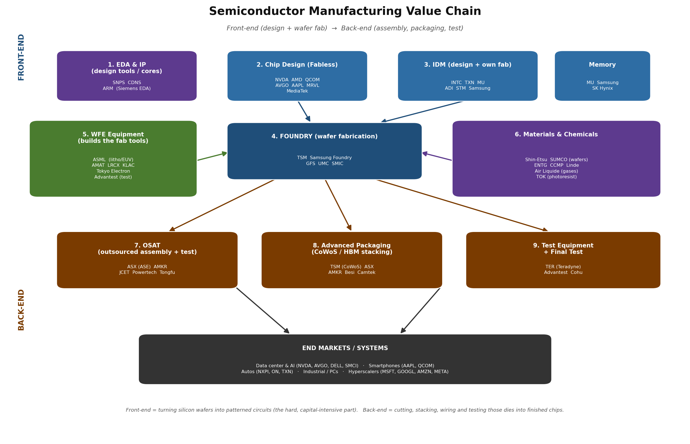
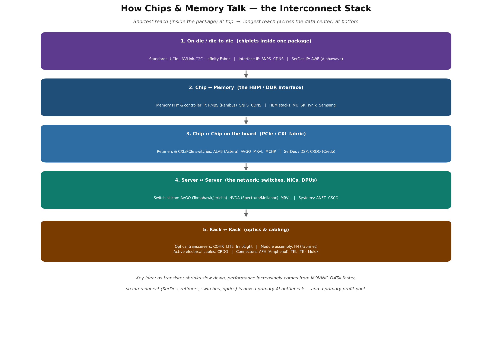
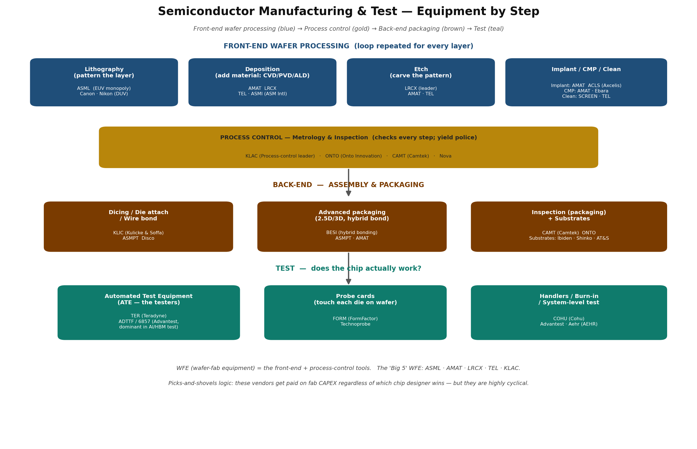
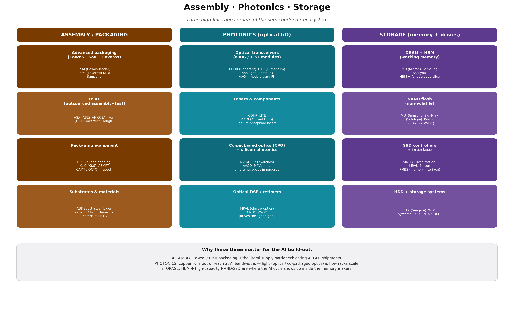

# Semiconductor Value Chain — Full Walkthrough

The core mental model: **front-end** = turning a blank silicon wafer into patterned circuits (the capital-intensive, physics-heavy part). **Back-end** = cutting that wafer into individual dies and packaging / wiring / testing them into a finished chip.

Diagrams referenced below live in the repo root: `semi_value_chain.png`, `semi_interconnect.png`, `semi_equipment.png`, `semi_assembly_photonics_storage.png`.

---

## FRONT-END (design → wafer fabrication)

**1. EDA & IP** — the software and reusable building blocks chips are designed with.
- `SNPS` (Synopsys), `CDNS` (Cadence) — duopoly in chip-design software. `ARM` — licenses the CPU cores in nearly every phone. Asset-light, high-margin, very sticky.

**2. Fabless design** — companies that design chips but own no factories.
- `NVDA`, `AMD`, `QCOM`, `AVGO`, `MRVL`, Apple's silicon, MediaTek. This is where the AI cycle's margin sits today.

**3. IDM** — design *and* manufacture in-house.
- `INTC`, `TXN`, `ADI`, `STM`, Samsung. Memory is its own oligopoly: `MU` (Micron), Samsung, SK Hynix — and HBM is the AI-leveraged sub-segment.

**4. Foundry** — pure-play wafer manufacturing for fabless customers. The chokepoint.
- `TSM` (Taiwan Semi, ~60%+ share and the only one at the leading edge at scale), Samsung Foundry, `GFS` (GlobalFoundries, mature nodes), `UMC`, SMIC (China).

**5. WFE (wafer-fab equipment)** — sells the multi-million-dollar tools fabs are built from. Picks-and-shovels.
- `ASML` — monopoly on EUV lithography (the single most important machine in the chain). `AMAT` (Applied Materials), `LRCX` (Lam, etch/deposition), `KLAC` (KLA, inspection/metrology), Tokyo Electron.

**6. Materials & chemicals** — the consumables every wafer burns through.
- Shin-Etsu / SUMCO (silicon wafers), `ENTG` (Entegris), `CCMP` (slurries), industrial gases (`Linde`, Air Liquide), photoresist (TOK).

## BACK-END (assembly → packaging → test)

**7. OSAT** — outsourced assembly and test; the back-end equivalent of a foundry.
- `ASX` (ASE Technology, the leader), `AMKR` (Amkor), JCET, Powertech.

**8. Advanced packaging** — increasingly the *new* battleground because shrinking transistors got hard, so performance now comes from stacking dies. This is the **CoWoS / HBM** bottleneck gating AI GPU supply.
- `TSM` (CoWoS), `ASX`, `AMKR`, plus packaging-equipment makers Besi, Camtek.

**9. Test equipment** — verifies each chip works.
- `TER` (Teradyne), Advantest (dominant in AI/HBM test), Cohu.

**End markets** then pull it all: AI/data-center, smartphones, autos (`NXPI`, `ON`, `TXN`), industrial — with the hyperscalers (`MSFT`, `GOOGL`, `AMZN`, `META`) as the demand engine right now.

### How to think about it as an investor
- **Bottleneck = pricing power.** The narrowest gates are `ASML` (EUV), `TSM` (leading-edge foundry), and CoWoS/HBM packaging. Whoever owns a chokepoint captures disproportionate margin.
- **Equipment/materials are the "sell the picks" plays** — they earn whether or not any single chip designer wins, but they're highly cyclical (capex-driven).
- **Fabless** gives you the most upside *and* the most competitive risk (design cycles, share shifts).
- **The whole chain is geographically concentrated** in Taiwan/Korea/Netherlands/Japan, which is why it's both a structural-growth story and a geopolitical-risk story.

---

## How chips & memory talk — the interconnect stack

Think of it as concentric rings of distance. Each ring has its own standard, its own silicon, and its own stocks. As classic transistor shrinking slows, *moving data* is where performance now comes from — so this whole layer has re-rated hard in the AI cycle.

1. **On-die / die-to-die** (chiplets inside one package). Modern GPUs are several "chiplets" stitched together. Standards: **UCIe**, NVIDIA's **NVLink-C2C**, AMD's **Infinity Fabric**. The connective IP is licensed from `SNPS`/`CDNS`; high-speed **SerDes IP** from `AWE` (Alphawave).
2. **Chip ↔ memory** — the HBM/DDR interface. This is the literal "make the chip talk to memory" layer. The PHY + memory-controller IP comes from `RMBS` (Rambus), `SNPS`, `CDNS`; the HBM stacks from `MU`, SK Hynix, Samsung.
3. **Chip ↔ chip on the board** — PCIe / CXL fabric. Signals degrade over copper, so you need **retimers** and **switches**: `ALAB` (Astera Labs, the breakout name), `AVGO`, `MRVL`, `MCHP`. SerDes/DSP: `CRDO` (Credo).
4. **Server ↔ server** — the network. Switch silicon: `AVGO` (Tomahawk/Jericho), `NVDA` (Spectrum + Mellanox NICs), `MRVL`. Systems/boxes: `ANET` (Arista), `CSCO`.
5. **Rack ↔ rack** — optics and cabling. Optical transceivers: `COHR`, `LITE`, InnoLight; module assembly `FN` (Fabrinet). Active electrical cables: `CRDO`. Connectors: `APH` (Amphenol), `TEL`, Molex.

One-line takeaway: **interconnect is now a primary AI bottleneck**, which is why names like `ALAB`, `CRDO`, `AVGO`, `COHR` and `APH` trade as AI plays even though they don't make the GPU.

---

## Manufacturing & test — equipment by step

**Front-end wafer processing** is a loop run hundreds of times (once per layer):
- **Lithography** (print the pattern): `ASML` — EUV monopoly, the single most strategic tool in the industry; Canon/Nikon in older DUV.
- **Deposition** (add material): `AMAT`, `LRCX`, `TEL`, `ASMI`.
- **Etch** (carve the pattern): `LRCX` leader, then `AMAT`, `TEL`.
- **Implant / CMP / Clean**: `AMAT`, `ACLS` (Axcelis), Ebara, SCREEN.

**Process control** sits across every step as the "yield police" — metrology and inspection: `KLAC` (clear leader), `ONTO`, `CAMT`, Nova.

**Back-end packaging** (assembly): dicing/bonding `KLIC`, ASMPT, Disco; advanced 2.5D/3D **hybrid bonding** `BESI`; packaging inspection `CAMT`/`ONTO`; ABF substrates from Ibiden, Shinko, AT&S.

**Test** — proving the chip works: ATE testers `TER` (Teradyne) and **Advantest** (dominant in AI/HBM test); probe cards `FORM` (FormFactor); handlers/burn-in `COHU`, Aehr (`AEHR`).

Two framing rules for the equipment side:
- The **"Big 5" WFE** — `ASML`, `AMAT`, `LRCX`, `TEL`, `KLAC` — are the truest picks-and-shovels: they get paid on fab **capex** no matter which designer wins. Trade-off: highly cyclical, exposed to China-export-control headlines.
- **Test/packaging equipment** (`TER`, Advantest, `BESI`, `FORM`) is leveraged specifically to **advanced packaging + HBM**, the part of the chain AI is straining most right now.

---

## Assembly · Photonics · Storage

### 1. Assembly / Advanced Packaging
The back-end "build the finished chip" step — now the **#1 physical bottleneck of the AI cycle**, because performance comes from stitching many dies + HBM stacks into one package rather than from a smaller transistor.
- **Advanced packaging (the platforms):** `TSM` owns **CoWoS** and **SoIC** — the exact capacity that gates how many Blackwell/MI300 GPUs ship. Intel has **Foveros/EMIB**; Samsung its own. CoWoS is sold out years ahead.
- **OSAT:** `ASX` (ASE), `AMKR` (Amkor — key US/Arizona partner), JCET, Powertech.
- **Packaging equipment:** `BESI` (hybrid-bonding leader), `KLIC` (Kulicke & Soffa), ASMPT; inspection `CAMT`/`ONTO`.
- **Substrates & materials:** ABF substrates (Ibiden, Shinko, AT&S, Unimicron) — a quiet bottleneck; `ENTG` materials.
- **Investor read:** highest-conviction "shovel" in AI right now because it's a hard physical constraint. `TSM`, `AMKR`, `BESI` are the cleanest expressions.

### 2. Photonics (optical I/O)
Copper signals die out over distance at AI bandwidths, so connecting thousands of GPUs means moving data as **light**.
- **Optical transceivers (the modules):** 800G → 1.6T pluggables. `COHR` and `LITE` lead in the West; InnoLight/Eoptolink dominate volume in China; `FN` (Fabrinet) does the contract assembly for most.
- **Lasers & components:** indium-phosphide lasers — `COHR`, `LITE`, `AAOI`. The hard-to-replicate physics layer.
- **Co-packaged optics (CPO):** the next leap — optics *inside* the switch/GPU package. `NVDA` announced CPO switches; `AVGO`, `MRVL`, Intel developing it.
- **Optical DSP / drivers:** `MRVL` (leader), `CRDO`, `AVGO`.
- **Investor read:** higher-growth but more volatile/competitive than packaging. `COHR` and `MRVL` are the most-leveraged liquid names; CPO is the optionality.

### 3. Storage (memory + drives)
The "remember things" layer, fastest/most-expensive to slowest/cheapest.
- **DRAM + HBM (working memory):** `MU` (Micron), Samsung, SK Hynix — tight 3-player oligopoly. The AI-leveraged slice is **HBM**; SK Hynix leads, `MU` gaining. HBM pricing pulled the whole DRAM market up.
- **NAND flash:** `MU`, Samsung, SK Hynix (+ Solidigm), Kioxia, SanDisk (split from WDC). More commoditized/cyclical; AI data volumes reviving enterprise SSD demand.
- **SSD controllers + interface:** `SIMO` (Silicon Motion), `MRVL`, Phison; `RMBS` for memory interface.
- **HDD + storage systems:** spinning disk still wins on cost-per-TB for AI data lakes — `STX` (Seagate), `WDC`. Systems: `PSTG` (Pure Storage), `NTAP`, `DELL`.
- **Investor read:** the most *cyclical* corner — fortunes swing with the memory price cycle. The AI signal shows up first in **HBM** (`MU`, SK Hynix) and enterprise SSD/HDD (`STX`, `WDC`).

---

*Full chain, end to end: design → fab → equipment → materials → interconnect → assembly → photonics → storage → test → end markets. For the six audited valuation reports built on this map (COHR, AVGO, CLS, ARM, NOW, FN) and the reverse-DCF explanation of why intrinsic targets sit below Street, see `SEMICONDUCTOR_ECOSYSTEM_AND_REPORTS.md` in this folder.*
